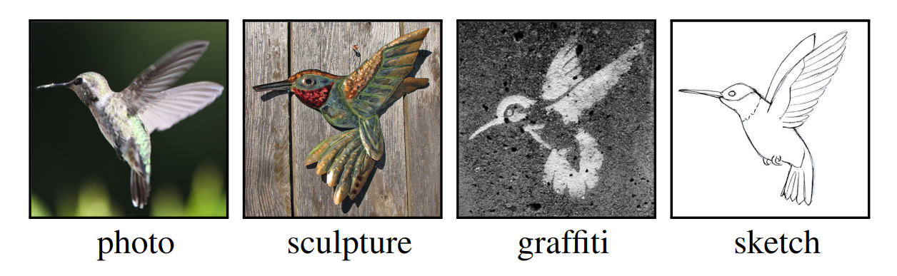
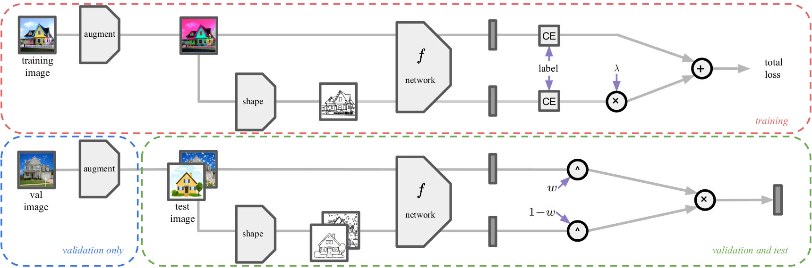

# Crafting Distribution Shifts for Validation and Training <br> in Single Source Domain Generalization (WACV 2025)
[](https://paperswithcode.com/sota/single-source-domain-generalization-on-pacs?p=crafting-distribution-shifts-for-validation)
[](https://paperswithcode.com/sota/single-source-domain-generalization-on-digits?p=crafting-distribution-shifts-for-validation)
[](https://paperswithcode.com/sota/photo-to-rest-generalization-on-minidomainnet?p=crafting-distribution-shifts-for-validation)
[](https://paperswithcode.com/sota/photo-to-rest-generalization-on-pacs?p=crafting-distribution-shifts-for-validation)
[](https://paperswithcode.com/sota/image-to-sketch-recognition-on-pacs?p=crafting-distribution-shifts-for-validation)
[](https://paperswithcode.com/sota/image-to-sketch-recognition-on-minidomainnet?p=crafting-distribution-shifts-for-validation)

This repository contains the PyTorch implementation of our WACV 2025 paper: **"Crafting Distribution Shifts for Validation and Training in Single Source Domain Generalization".** [[ArXiv](https://www.arxiv.org/abs/2409.19774)]

<div align="center">
  
</div>

## Overview
### Motivation
Single-source domain generalization attempts to learn a model on a source domain and deploy it to unseen target domains. Limiting access only to source domain data imposes two key challenges – how to train a model that can generalize and how to verify that it does. The standard practice of validation on the training distribution does not accurately reflect the model’s generalization ability, while validation on the test distribution is a malpractice to avoid. In this work, we follow a fundamental direction in the generalization task, i.e., data augmentations, to synthesize new distributions, but in contrast to the standard practive we apply them to the validation set instead, to estimate the method’s performance on multiple distribution shifts.

### Approach
Since these augmentations are also valuable in the training phase, we propose a k-fold cross-validation scheme performed across augmentation types to get the best of both worlds. This way, the training set is augmented with challenging examples while, at the same time, the validation provides an unbiased estimate of performance on unseen distributions. 

Besides the novel validation method for SSDG, we propose a family of classification methods parametrized by several train and test-time hyper-parameters. The values of these parameters are selected by the proposed validation method. We focus on enforcing shape bias, whose effectiveness is demonstrated in prior work. We accomplish this by using a specialized image transformation technique, employing enhanced edge maps that eliminate textures while retaining crucial shape information. The transformation is performed both during training and testing.

<div align="center">
  
</div>

## Environment
Our experiments were conducted using **python 3.10**. To set up the environment, run:
```
python -m venv ~/craft
source ~/craft/bin/activate
pip install -r requirements.txt
```

## Pre-trained models
For experiments with AlexNet, download the [Caffenet model](https://drive.google.com/file/d/1wUJTH1Joq2KAgrUDeKJghP1Wf7Q9w4z-/view?pli=1) from the [JigenDG repository](https://github.com/fmcarlucci/JigenDG) and place it in the `Pretrained_Models` folder: 
```
crafting-shifts/
    ├── Pretrained_Models/
    │   └── alexnet_caffe.pth.tar
```
## Dataset
Download the **PACS dataset** and place it in the directory data/PACS/PACS_Original:
```
crafting-shifts/
    ├── data/
    │   └── PACS/
    │       └── PACS_Original/
    │           ├── art_painting/
    │           ├── cartoon/
    │           ├── photo/
    │           └── sketch/
```
To generate the augmented PACS datasets with different augmentation categories, run:
```
python create_imgaug_datasets.py --dataset PACS
```
This will create ten copies of PACS, each with a different augmentation category. The final data directory structure should look like this:
```
crafting-shifts/
    ├── data/
    │   └── PACS/
    │       ├── PACS_Imgaug_arithmetic/
    │       ├── PACS_Imgaug_artistic/
    │       ├── PACS_Imgaug_blur/
    │       ├── PACS_Imgaug_color/
    │       ├── PACS_Imgaug_contrast/
    │       ├── PACS_Imgaug_convolutional/
    │       ├── PACS_Imgaug_edges/
    │       ├── PACS_Imgaug_geometric/
    │       ├── PACS_Imgaug_segmentation/
    │       ├── PACS_Imgaug_weather/
    │       └── PACS_Original/
    │           ├── art_painting/
    │           ├── cartoon/
    │           ├── photo/
    │           └── sketch/
    │       ├── art_painting_test.csv
    │       ├── art_painting_train.csv
    │       ├── art_painting_val.csv
    │       ├── cartoon_test.csv
    │       ├── cartoon_train.csv
    │       ├── cartoon_val.csv
    │       ├── photo_test.csv
    │       ├── photo_train.csv
    │       ├── photo_val.csv
    │       ├── sketch_test.csv
    │       ├── sketch_train.csv
    │       └── sketch_val.csv
```

## Running Experiments
### Recognition Method

For a quick experiment on a single model, specify a high-performing learning rate (e.g., 0.00154) and choose from CaffeNet, ResNet18, or ViT-Small as the backbone. Results are printed and saved in the Results folder.
```
python method.py --run experiments/yaml_PACS_imgaug_canny-all.yaml --train_only photo --seed 0 --method_loss 1 --lr 0.00154 --epochs 300 --backbone caffenet --dataset PACS --gpu 0
```
```
python method.py --run experiments/yaml_PACS_imgaug_canny-all.yaml --train_only photo --seed 0 --method_loss 1 --lr 0.00154 --epochs 300 --backbone resnet18 --dataset PACS --gpu 0
```
```
python method.py --run experiments/yaml_PACS_imgaug_canny-all.yaml --train_only photo --seed 0 --method_loss 1 --lr 0.00154 --epochs 300 --backbone vit_small --dataset PACS --gpu 0
```
### Validation Method
For the full set of experiments, including 5 experiment types, 3 backbones, 33 learning rates, and multiple seeds:

1. Run the following commands for each backbone. Adjust GPU allocation as needed; ResNet18 and CaffeNet take ~1 day on a Tesla A100, while ViT-Small takes ~3.5 days.
```
# experiment name, number of seeds, backbone, gpu id
bash run_k_experiments.sh yaml_PACS_imgaug_canny-all.yaml 5 resnet18 0
bash run_k_experiments.sh yaml_PACS_imgaug_canny-first.yaml 5 resnet18 0
bash run_k_experiments.sh yaml_PACS_imgaug_canny-second.yaml 5 resnet18 0
bash run_k_experiments.sh yaml_PACS_original_canny.yaml 5 resnet18 0
bash run_k_experiments.sh yaml_PACS_original.yaml 5 resnet18 0

bash run_k_experiments.sh yaml_PACS_imgaug_canny-all.yaml 5 caffenet 0
bash run_k_experiments.sh yaml_PACS_imgaug_canny-first.yaml 5 caffenet 0
bash run_k_experiments.sh yaml_PACS_imgaug_canny-second.yaml 5 caffenet 0
bash run_k_experiments.sh yaml_PACS_original_canny.yaml 5 caffenet 0
bash run_k_experiments.sh yaml_PACS_original.yaml 5 caffenet 0

bash run_k_experiments.sh yaml_PACS_imgaug_canny-all.yaml 3 vit_small 0
bash run_k_experiments.sh yaml_PACS_imgaug_canny-first.yaml 3 vit_small 0
bash run_k_experiments.sh yaml_PACS_imgaug_canny-second.yaml 3 vit_small 0
bash run_k_experiments.sh yaml_PACS_original_canny.yaml 3 vit_small 0
bash run_k_experiments.sh yaml_PACS_original.yaml 3 vit_small 0
```
2. After completing the experiments, aggregate the results using the following commands. This will create `Total_results.csv` in each experiment folder, summarizing the model performance according to each validation method.
```
python aggregate_results.py --dataset PACS --backbone resnet18 --seeds 0 1 2 3 4 --main_exp_name imgaug_and_canny_training_all --cv_exp_names imgaug_and_canny_training_first imgaug_and_canny_training_second
python aggregate_results.py --dataset PACS --backbone resnet18 --seeds 0 1 2 3 4 --main_exp_name original_and_canny_training
python aggregate_results.py --dataset PACS --backbone resnet18 --seeds 0 1 2 3 4 --main_exp_name original-only_training

python aggregate_results.py --dataset PACS --backbone caffenet --seeds 0 1 2 3 4 --main_exp_name imgaug_and_canny_training_all --cv_exp_names imgaug_and_canny_training_first imgaug_and_canny_training_second
python aggregate_results.py --dataset PACS --backbone caffenet --seeds 0 1 2 3 4 --main_exp_name original_and_canny_training
python aggregate_results.py --dataset PACS --backbone caffenet --seeds 0 1 2 3 4 --main_exp_name original-only_training 

python aggregate_results.py --dataset PACS --backbone vit_small --seeds 0 1 2  --main_exp_name imgaug_and_canny_training_all --cv_exp_names imgaug_and_canny_training_first imgaug_and_canny_training_second
python aggregate_results.py --dataset PACS --backbone vit_small --seeds 0 1 2  --main_exp_name original_and_canny_training
python aggregate_results.py --dataset PACS --backbone vit_small --seeds 0 1 2  --main_exp_name original-only_training 
```
As a final step, to produce the V<sub>S</sub>-test and V<sub>A</sub>-test scatter plots for all experiment-backbone combination (as in Figure 4 of the paper), run:
```
python make_scatter_plots.py --dataset PACS
```
The scatter plots will be saved in the `Results` folder.
