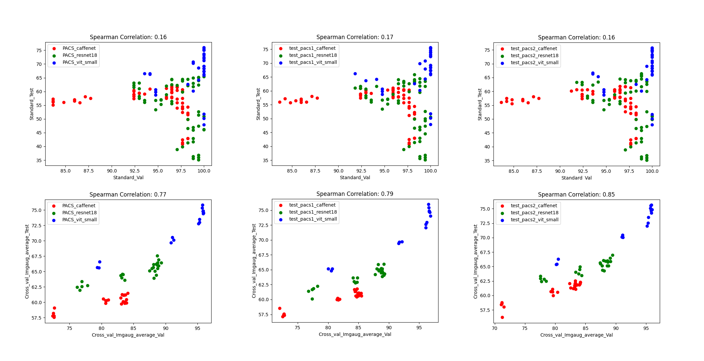

# Crafting Distribution Shifts for Validation and Training <br> in Single Source Domain Generalization (WACV 2025)
[](https://paperswithcode.com/sota/single-source-domain-generalization-on-pacs?p=crafting-distribution-shifts-for-validation)
[](https://paperswithcode.com/sota/single-source-domain-generalization-on-digits?p=crafting-distribution-shifts-for-validation)
[](https://paperswithcode.com/sota/photo-to-rest-generalization-on-minidomainnet?p=crafting-distribution-shifts-for-validation)
[](https://paperswithcode.com/sota/photo-to-rest-generalization-on-pacs?p=crafting-distribution-shifts-for-validation)
[](https://paperswithcode.com/sota/image-to-sketch-recognition-on-pacs?p=crafting-distribution-shifts-for-validation)
[](https://paperswithcode.com/sota/image-to-sketch-recognition-on-minidomainnet?p=crafting-distribution-shifts-for-validation)

This repository contains the PyTorch implementation of our WACV 2025 Oral paper: **"Crafting Distribution Shifts for Validation and Training in Single Source Domain Generalization".** [[ArXiv](https://www.arxiv.org/abs/2409.19774)]

<div align="center">
  
</div>

## Overview
### Motivation
Single-source domain generalization attempts to learn a model on a source domain and deploy it to unseen target domains. Limiting access only to source domain data imposes two key challenges – how to train a model that can generalize and how to verify that it does. The standard practice of validation on the training distribution does not accurately reflect the model’s generalization ability, while validation on the test distribution is a malpractice to avoid. In this work, we follow a fundamental direction in the generalization task, i.e., data augmentations, to synthesize new distributions, but in contrast to the standard practice, we apply them to the validation set instead, to estimate the method’s performance on multiple distribution shifts.

### Approach
Since these augmentations are also valuable in the training phase, we propose a k-fold cross-validation scheme performed across augmentation types to get the best of both worlds. This way, the training set is augmented with challenging examples while, at the same time, the validation provides an unbiased estimate of performance on unseen distributions. 

Besides the novel validation method for SSDG, we propose a family of classification methods parametrized by several train and test-time hyper-parameters. The values of these parameters are selected by the proposed validation method. We focus on enforcing shape bias, which is effectively demonstrated in prior work. We accomplish this by using a specialized image transformation technique, employing enhanced edge maps that eliminate textures while retaining crucial shape information. The transformation is performed both during training and testing.

<div align="center">
  
</div>

## Environment
Our experiments were conducted using **python 3.10**. To set up the environment, run:
```
python -m venv ~/craft
source ~/craft/bin/activate
pip install -r requirements.txt
```

## Pre-trained models
For experiments with AlexNet, download the [Caffenet model](https://drive.google.com/file/d/1wUJTH1Joq2KAgrUDeKJghP1Wf7Q9w4z-/view?pli=1) from the [JigenDG repository](https://github.com/fmcarlucci/JigenDG) and place it in the `Pretrained_Models` folder: 
```
crafting-shifts/
    ├── Pretrained_Models/
    │   └── alexnet_caffe.pth.tar
```
## Dataset
Download the **PACS dataset** and place it in the directory `data/PACS/PACS_Original`:
```
crafting-shifts/
    ├── data/
    │   └── PACS/
    │       └── PACS_Original/
    │           ├── art_painting/
    │           ├── cartoon/
    │           ├── photo/
    │           └── sketch/
```
To generate the augmented PACS datasets with different special augmentation categories, run:
```
python create_imgaug_datasets.py --dataset PACS
```
This will create ten copies of PACS, each with a different special augmentation category. The final data directory structure should look like this:
```
crafting-shifts/
    ├── data/
    │   └── PACS/
    │       ├── PACS_Imgaug_arithmetic/
    │       ├── PACS_Imgaug_artistic/
    │       ├── PACS_Imgaug_blur/
    │       ├── PACS_Imgaug_color/
    │       ├── PACS_Imgaug_contrast/
    │       ├── PACS_Imgaug_convolutional/
    │       ├── PACS_Imgaug_edges/
    │       ├── PACS_Imgaug_geometric/
    │       ├── PACS_Imgaug_segmentation/
    │       ├── PACS_Imgaug_weather/
    │       └── PACS_Original/
    │           ├── art_painting/
    │           ├── cartoon/
    │           ├── photo/
    │           └── sketch/
    │       ├── art_painting_test.csv
    │       ├── art_painting_train.csv
    │       ├── art_painting_val.csv
    │       ├── cartoon_test.csv
    │       ├── cartoon_train.csv
    │       ├── cartoon_val.csv
    │       ├── photo_test.csv
    │       ├── photo_train.csv
    │       ├── photo_val.csv
    │       ├── sketch_test.csv
    │       ├── sketch_train.csv
    │       └── sketch_val.csv
```

## Running Experiments
### Recognition Method

For a quick experiment on a single model, specify a high-performing learning rate and choose from **CaffeNet**, **ResNet18**, or **ViT-Small** as the backbone. Results are printed and saved in the `Results/experiment_name` folder.
```
python method.py --run experiments/yaml_PACS_imgaug_canny-all.yaml --backbone caffenet --train_only photo --seed 0 --method_loss 1 --lr 0.00154 --epochs 300 --dataset PACS --gpu 0
```
```
python method.py --run experiments/yaml_PACS_imgaug_canny-all.yaml --backbone resnet18 --train_only photo --seed 0 --method_loss 1 --lr 0.00154 --epochs 300 --dataset PACS --gpu 0
```
```
python method.py --run experiments/yaml_PACS_imgaug_canny-all.yaml --backbone vit_small --train_only photo --seed 0 --method_loss 1 --lr 0.00154 --epochs 300 --dataset PACS --gpu 0
```
**Note:** The learning rate 0.00154 happens to work great for all three architectures.
### Validation Method
The `method.py` script automatically performs a grid search for `--lr` (learning rate) and `--method_loss` (method loss weight) if they aren’t specified. To evaluate the validation method’s effectiveness, we recommend running the 5 configurations provided in this section that correspond to 3 experiments. For them, we suggest a learning rate search of 33 learning rates, using 3 backbones with 5 seeds each for **CaffeNet** and **ResNet18**, and 3 seeds for **ViT-Small**:

Run the following commands for the **ResNet18** backbone. Adjust GPU allocation and number of seeds as needed. The main experiment of the paper involves three configurations:

- **`yaml_PACS_imgaug_canny-all.yaml`**: Uses all special augmentation categories during training.
- **`yaml_PACS_imgaug_canny-first.yaml`** and **`yaml_PACS_imgaug_canny-second.yaml`**: Use only the first and second fold of the special augmentations, respectively. This is to select the best learning rate for the **`yaml_PACS_imgaug_canny-all.yaml`** experiment.

```
# experiment name, number of seeds, backbone, gpu id
bash run_k_experiments.sh yaml_PACS_imgaug_canny-all.yaml 5 resnet18 0
bash run_k_experiments.sh yaml_PACS_imgaug_canny-first.yaml 5 resnet18 1
bash run_k_experiments.sh yaml_PACS_imgaug_canny-second.yaml 5 resnet18 2
```
In order to evaluate the proposed validation method for model selection you need more training:
1. Some sub-optimal configurations:
- **`yaml_PACS_original_canny.yaml`**: Uses no special augmentations.
- **`yaml_PACS_original.yaml`**: Is vanilla training.
```
bash run_k_experiments.sh yaml_PACS_original_canny.yaml 5 resnet18 0
bash run_k_experiments.sh yaml_PACS_original.yaml 5 resnet18 1
```
2. Different backbones:
For **CaffeNet** and **ViT-Small** backbones, replace `resnet18` with `caffenet` or `vit_small` for all the experiments above, like so:
```
# Replace 'resnet18' with 'caffenet' or 'vit_small' as needed
bash run_k_experiments.sh yaml_PACS_imgaug_canny-all.yaml 5 caffenet 0
bash run_k_experiments.sh yaml_PACS_imgaug_canny-all.yaml 3 vit_small 1
```
**ResNet18** and **CaffeNet** take ~1 day on a Tesla A100, while **ViT-Small** takes ~3.5 days.

**Note:** If the times above are overwhelming, feel free to reduce the number of learning rates in the search from 33 to a smaller number, i.e., 10, by editing the `run_k_experiments.sh` file and adding `--lr_search_no 10` to the python run. This will reduce the time to one-third.

After completing the experiments, aggregate the results using the following commands. This will create `Total_results.csv` in each of the experiment folders specified by `--main_exp_name`. This csv is summarizing the model performance according to each validation method. For experiments that need cross-validation, the extra training configurations are specified by `--cv_exp_names`.
```
python aggregate_results.py --dataset PACS --backbone resnet18 --seeds 0 1 2 3 4 --main_exp_name imgaug_and_canny_training_all --cv_exp_names imgaug_and_canny_training_first imgaug_and_canny_training_second
python aggregate_results.py --dataset PACS --backbone resnet18 --seeds 0 1 2 3 4 --main_exp_name original_and_canny_training
python aggregate_results.py --dataset PACS --backbone resnet18 --seeds 0 1 2 3 4 --main_exp_name original-only_training
```
Aggregate the results for all the experiments you run by changing the `--backbone`, and `--seeds` accordingly. For example, if only 3 seeds were used for a `vit_small` experiment, change the aggregation specifications like so:
```
python aggregate_results.py --dataset PACS --backbone vit_small --seeds 0 1 2  --main_exp_name imgaug_and_canny_training_all --cv_exp_names imgaug_and_canny_training_first imgaug_and_canny_training_second
```

As a final step, to produce the V<sub>S</sub>-test and V<sub>A</sub>-test scatter plots for all experiment-backbone combinations for a given dataset (as in Figure 4 of the paper), run:
```
python make_scatter_plots.py --dataset PACS
```
The scatter plots will be saved in the `Results` folder. The following scatter plots for V<sub>S</sub> (top) and V<sub>A</sub> (bottom) are calculated for three different variations of the augmented PACS, that is three different executions of the `create_imgaug_datasets.py`. This shows that the proposed validation is robust to the augmentation randomness.
<div align="center">
  
</div>

## Citation
If you find this repository useful, please consider giving a star 🌟 and citation:

```latex
@inproceedings{efth2025crafting,
  title={Crafting Distribution Shifts for Validation and Training in Single Source Domain Generalization},
  author={Efthymiadis, Nikos and Tolias, Giorgos and Chum, Ondřej},
  booktitle={IEEE Winter Conference on Applications of Computer Vision},
  year={2025},
  organization={IEEE}
}
```
